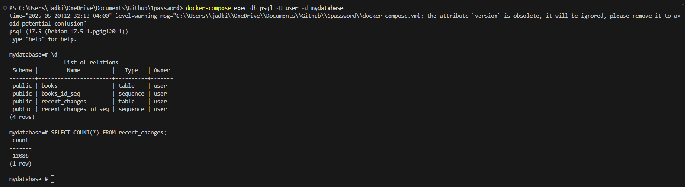

# Data Engineering Take Home Assignment:

### How to Run:

Run the entire application:
```bash
docker compose up
```

Run the python application only:
```bash
docker compose up --build pythonapp
```

Connect to postgres database:
```bash
docker exec -it $(docker compose ps -q  db) psql -U user -d mydatabase
```

Example command to list tables: 
```bash
\d
```
Example commands for pSQL :
```bash
-- Count rows in recent_changes
SELECT COUNT(*) FROM recent_changes;

-- Count rows in books
SELECT COUNT(*) FROM books;
```

How to spin down the container (to rebuild from scratch):
```bash
docker-compose down
```
Example Data Returned


Example Docker Desktop container created:
