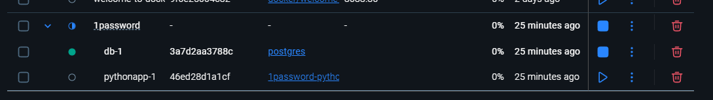

# 🚀 Data Engineering Take Home Assignment

Welcome aboard the data rocket (aka the 1password take home assignment)! This guide walks you through spinning up the app, exploring the database, and running queries—all smooth and simple.

---

### How to Run the Full Application

Fire up everything with one command:

```bash
docker compose up
```
Example Docker Desktop container created:



### Connect to the PostgreSQL Database

Hop inside the running container and open psql:

```bash
docker exec -it $(docker compose ps -q db) psql -U user -d mydatabase
```


### Quick Commands Cheat Sheet: 
List all the tables and sequences

```bash
\d
```
List just the tables
```bash
\dt
```

### Example output from \dt: 
```bash
                List of relations
 Schema |          Name          | Type  | Owner 
--------+------------------------+-------+-------
 public | authors                | table | user
 public | book_metadata_detailed | table | user
 public | books                  | table | user
 public | recent_changes         | table | user
 public | work_metadata_detailed | table | user
 public | works                  | table | user
```


### Quick Queries to explore the data :
```bash
-- Count rows in recent_changes
SELECT COUNT(*) FROM recent_changes;

-- Count rows in books
SELECT COUNT(*) FROM books;

-- Book metadata
SELECT * FROM book_metadata_detailed;

-- work metadata
SELECT * FROM work_metadata_detailed;
```

How to spin down the container
```bash
docker-compose down
```

# Appendix:

#### Massive Cleanup
```bash
docker-compose down -v
docker-compose build --no-cache
docker-compose up
```


#### Run the python application only. Not necessary for this work - informational only.
```bash
docker compose up --build pythonapp
```